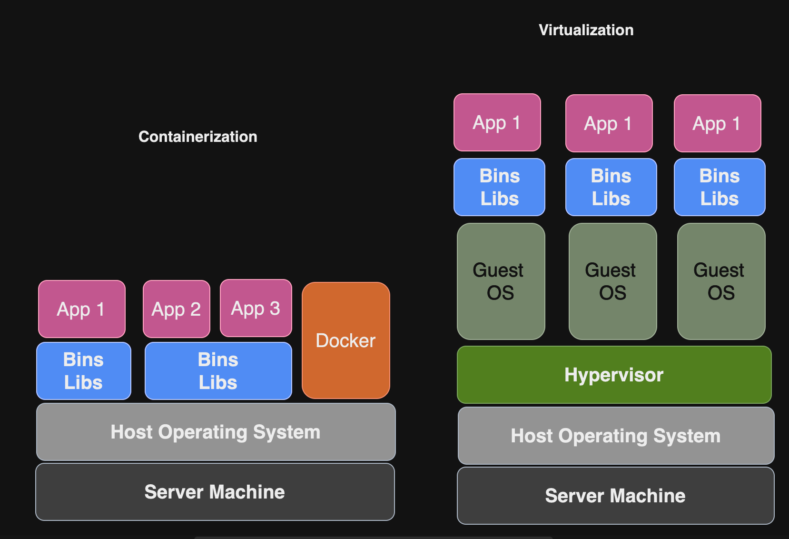
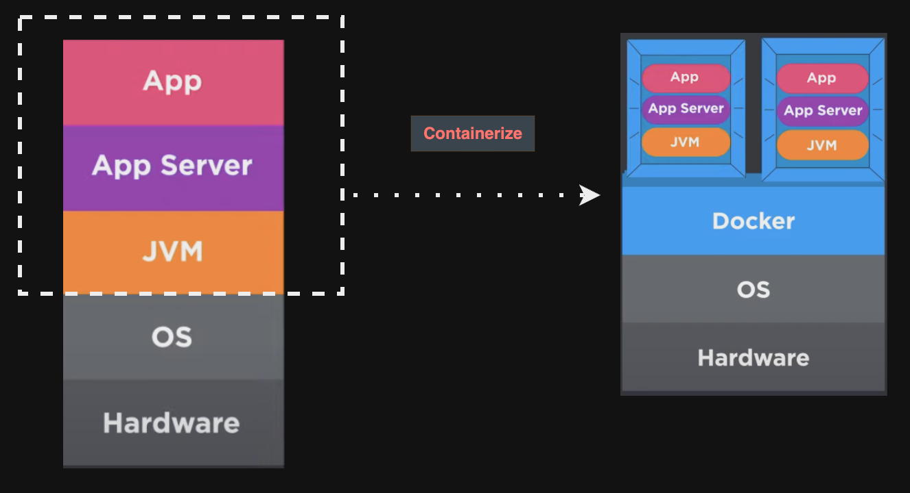
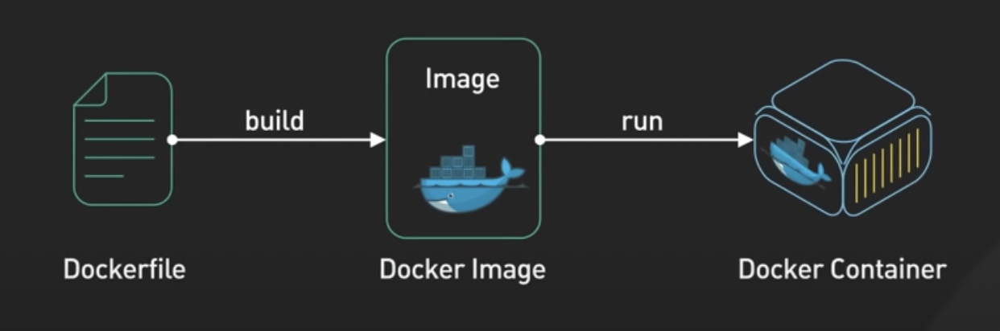

### History of Containerization

The initial concepts of containerization originated when developers faced challenges in application management. Security was at the top of their list of challenges. In a typical scenario, one Linux system server might be used as a database service, with the file server and web server running on the same operating system. However, non-isolated applications are not considered to be the best practice. A successful attack on one service can compromise the other services. This non-isolated application approach puts the services at risk of cyber attacks by increasing the surface area for potential breaches.

The chroot system call was first introduced in Unix V7 in 1979. When the application starts, it isolates itself to a specific directory on the filesystem and uses that directory as its apparent root directory. In 2002, the Linux kernel implemented the namespace feature, allowing an application to run in its own virtual environment without the overhead of virtualization. Enginee at Google created control groups "cgroups". This Linux feature merged into the Linux kernel around 2007. Linux Containers (LCX) was relased in 2008 .LXC is An operating-system-level virtualization technique that enables multiple isolated Linux containers to run on a single host, all sharing the same Linux kernel. LXC provided features included namespace and cgroups and other. In 2013, Docker was founded as a containerization platform based on Linux. The following year, in 2014, Google created the Kubernetes project as an open-source container orchestrator.[1]


### What is Containerization Technology 

Containerization is a software deployment process that combines an application's code with necessary files and libraries for running on various infrastructures, allowing for the creation of a single, scalable software package that runs on various devices and operating systems [2]. 

List of Top Key Players in Container Management Software Market:

    - Google
    - IBM
    - Microsoft
    - Cisco
    - Amazon
    - SUSE
    - Docker Inc
    - Kubernetes
    - RedHat OpenShift
    .....

### Differences Between Containerization and Virtualization
| Item              |Containerization   | Virtualization |
| :---------------- | :------: | ----: |                 
| Startup Time      |   Faster   |  Much longer to boot up |
| Operating system  | Shares the host operating system's kernel   |   Has its own kernel   |
| Resource usage    |  Uses fewer resources   | Uses more resources |
| Use cases|  Good for portable and scalable applications| Good for isolated applications 

Containers run on a shared OS kernel provided by the host operating system. This means that containers use the host’s operating system services,drivers, and kernel, which allows for efficient resource utilization. The shared components of the OS are read-only to prevent interference between containers. Consequently, containers demand fewer resources and have lower overhead compared to virtual machines. This efficiency allows significantly more containers to run on a single server. For instance, virtual machines may require gigabytes of storage each, while containers running similar programs may only need megabytes. [3]



## Benefits of containerization :

- Portability
- Agility
- Speed
- Fault isolation
- Efficiency
- Ease of management
- Security

  [Benefits of containerization - IBM](https://www.ibm.com/topics/containerization)

### What's Docker?



Docker is a framework for creating, depolying, and managing containers.Docker container start fast and use less memory. It caches layers to make build faster.

Docker client talks to the Docker daemon, which does the heavy lifting of building, running, and distributing your Docker containers. When you execute a docker run command to initiate a container, your Docker client interprets this command into an HTTP API call and forwards it to the Docker daemon. Subsequently, the Docker daemon processes the request, communicates with the underlying operating system, and facilitates the provisioning of your container.


|  | 
|:--:| 
| *[image source](https://docs.docker.com/get-started/overview/)* |


    Ensure that the Docker daemon is up and active.
     by running `docker info`

### What is Docker Image?

Docker images are the foundation for running containers. It is a self-contained, immutable, lightweight package that contains all the necessary components to run software independently. Once created, it cannot be changed but they can be versioned for easy management.


### Images Contain Two Types of Things :
---

1 - A collection of layers that are combined to form the filesystem that will be seen within the container.

2 - Acollection of configuration options that provide the defualts for any containers launched using that image.

    To build an image, you'll need to use a Dockerfile as one option.
---

|  | 
|:--:| 
| *Image Source - ByteByteToGo* |
---

### What 's Dockerfile?

A Dockerfile is simply a text-based file with no file extension that contains a script of instructions. Docker uses this script to build a container image. A Dockerfile defines the steps needed to create a Docker image.

Now it's time to initiate a container from the Dockerfile.

### Docker containe
It is a running instance of a Docker image, offering a lightweight and isolated environment for applications. It provides process-level isolation and high portability.

After understanding the foundation of containerization, Docker images, and Dockerfiles, now it's time to see a real example


### Docker Volumes
Docker volumes are used for:

- Persisting container data.
- Sharing data between containers.
- Exposing data to the host system.
- Docker supports two types of volumes: internal volumes and  external volumes.

Internal Volumes: Managed entirely by Docker. They are stored in Docker’s managed storage areas and are not directly accessible or visible on the host filesystem.
External Volumes: These bind mounts a file or directory from the host system directly into a container, allowing for direct access from both the host and the container.

#### Key Concepts
- Target: The file or directory path inside the container where the volume data is mounted.
- Source: The file or directory path on the host machine where the volume data is stored.


### Uploading Images
To upload an image to public registry or JFrog Artifactory.
- Authenticate 
    Docker - docker login
        - Username: myaccount
        - Paswword: *******
    Artifactory - 
- Tag the image with the remote registry/ repository
      > docker image tag <app_dev>   <myaccount>/<app_prod>:tag
      - tag can be 1.0.0 or Latest
- Push the image
      > docker image push  <username>/<app_prod>

        
    
## Docker Compose
---
Docker Compose allows you to define and manage multi-container applications in a single YAML file. It assists in interconnecting a set of containers and describes them in a succinct way.
The `docker-compose`command can be used to buils, and start a set of containers.
Compose version `3.x` is latest recommended for unlocking the most recent feature. 


### Docker Compose Attributes 

- `version` refers to the Docker Compose version (latest is 3).
- `services` defines the services that we need to run.
- `app` is a custom name for one of the containers.
- `image` specifies the image that we need to pull.
- c`ontainer_name` is the name for the container.
- `environment` defines the environment variables, such as DB credentials.
- `ARG` defines variables before the image is built.
- `ENV` sets the environment after the image is built.
- `RUN` executes commands within the container at build time.
- `EXPOSE` informs Docker that the built container listens on the specified network port at runtime.

## Docerize  Java Projects
---
For Java applications, JAR files can be built with the help of build tools such as Maven and Gradle. The Java JAR file can be moved into a Docker container and run inside it with a few Dockerfile instruction lines. Another approach is to move the Java application files inside the container, build them there, and then run the resulting JAR file.

- Locate the jar under `/build/libs/XXX.jar`. This only applies to Gradle projects. For Maven projects, look under the `/target/` folder for the JAR file

Build the project by running gradle build or mvn install depending on your build tool.

Build tasks include compiling classes, creating a JAR file, generating Javadoc, and publishing archives to a repository.


- Create a Dockerfile to build an image
    - Refer to the Dockerfile in the root directory of the project
    >  docker build 

 -  Creating and starting a container
   > docker run  --name app-name - d   XYZ 
  - Listing containers 

       ``` > docker ps```

        -s show size
        -q only print IDs

---


#### List of helpful command  and Notes :
---

##### Uploading Images
- Step 1: Loging into registry/repositry

        # docker login artifactory-xxx.cyber.yy.com
        # Provide your password
        # Login Succeeded

To upload an image first tag it with the remote registry/repositry

    # docker tag app_dev artifactory-xxx.cyber.yy.com/repositry_name

    # docker tag gradle:latest  artifactory-jcr.cyber-range.ray.com/   aces-docker-release-local/gradle:1:0
    # docker image push  artifactory-jcr.cyber-range.ray.com/aces-docker-release-local/gradle:1:0
    ---

##### Remove all docker container
`docker conatianer rm -f $(docker conatianer ls -aq)`

-a (or --all): This flag includes all containers, not just the running ones. This means it will list running, stopped, and exited containers.
-q (or --quiet): This flag shows only the container IDs.

##### Remove all docker Images
`docker image rm -f $(docker image ls -aq)`

-a (or --all): This flag includes all containers, not just the running ones. This means it will list running, stopped, and exited containers.
-q (or --quiet): This flag shows only the container IDs.
#####  Copying files from Docker container to host
---

    Docker ps - a   <To get containerId>
    docker cp <containerId>:/file/path/within/container /host/path/target
---
##### Docker push
---
<pre>
Let's assume our image_name is "gradle"

Step 1 ) docker login Artifactory URL or Docker Registrey

Step 2 ) docker tag gradle:latest
  artifactory-xyz.cyVer-abcd.klmn.com/aces-docker-release-local/gradle:1:0

Step 3 ) docker image push artifactory-xyz.cghier-abcd.klmn.com/(aces-docker-release-local)(gradle:1:0)
</pre>

##### Pull Docker Image
    docker pull <Image Name>

##### Log
    docker log containerName

Note:
- `jar files, ".jar"` is essentially a ZIP file that can contain a variety of files. Typically, it includes compiled Java code (.class files), but it can also contain Java source code (.java files), configuration files, images, or any other resources required by a Java application.[3]


##### Port mapping  

- The first 3306 before the colon (:) represents the port inside the MySQL container.
- The second 3306 after the colon (:) represents the port on the host machine.

Refrence:
--
1- https://www.techtarget.com/searchitoperations/feature/ Dive-into-the-decades-long-history-of-container-technology


https://www.redhat.com/en/topics/containers

2- https://blog.bytebytego.com/p/what-are-the-differences-between
3- https://www.techradar.com/news/what-is-container-technology